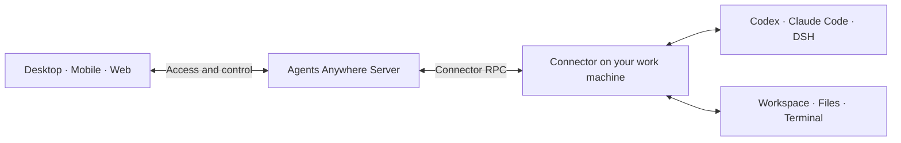

<p align="center">
  <a href="https://www.agents-anywhere.com/en"></a>
</p>

<p align="center">
  <strong>Connect your work machines. Manage AI agents from desktop, mobile and Web.</strong><br>
  Open source · Multiple agents · Sessions and workspaces · Self-hosting
</p>

<p align="center">
  <a href="https://www.agents-anywhere.com/en">Website</a> ·
  <a href="#downloads-and-access">Download</a> ·
  <a href="https://web.agents-anywhere.com">Open Web</a> ·
  <a href="docs/README.md">Documentation</a> ·
  <a href="README.md">简体中文</a>
</p>

<p align="center">
  <a href="docs/releases/2.0.0.md"></a>
  <a href="#license"></a>
  <a href="docker/README.md"></a>
</p>

**Agents Anywhere** is an open-source agent workbench across your devices. Connect a work machine running **Codex, Claude Code or DeepSeek Harness**, then view sessions, respond to requests, manage files and use terminals from desktop, mobile and Web. Agents execute tasks on the connected work machine.

## Downloads and access

Install the desktop client on your work machine, then access it from your phone, tablet or Web. Use the Connector CLI to connect Linux and headless servers. Each client can connect to Cloud or a self-hosted service.

**Use Web directly:** open [web.agents-anywhere.com](https://web.agents-anywhere.com) and sign up or sign in to get started. Servers are hosted in mainland China, where users can expect the best connection experience.

| Platform | Get the client |
| --- | --- |
| **macOS** | [Universal DMG · 2.0.0](https://modelscope.cn/models/t4wefan/deepseek-harness-desktop/resolve/master/Agents%20Anywhere-2.0.0-universal.dmg) |
| **Windows** | [x64 installer · 2.0.0](https://modelscope.cn/models/t4wefan/deepseek-harness-desktop/resolve/master/Agents%20Anywhere%20Setup%202.0.0-x64.exe) |
| **iOS / iPadOS** | [Join TestFlight](https://testflight.apple.com/join/GKGaut99) |
| **Android** | [APK · 2.0.3](https://modelscope.cn/models/t4wefan/deepseek-harness-desktop/resolve/master/agents-anywhere-2.0.3-release.apk) |
| **Web** | [Open Web](https://web.agents-anywhere.com) |
| **Linux / headless** | [Run the Connector CLI](connector/README.md) |

See the [download page](https://www.agents-anywhere.com/en/download) for platform details. Read the [upgrade guide](docs/upgrading.md) before upgrading a legacy deployment.

<details>
<summary>Platform requirements, installers and updates</summary>

- macOS: Universal for Apple Silicon / Intel; signed and notarized.
- Windows: x64 desktop workbench with a managed Connector; the current installer is not code signed.
- Android: Android 8.0 or later.
- iOS / iPadOS: install the beta through TestFlight; availability is shown on the invitation page.
- Linux / headless: run the Connector on the work machine and control it from another client.

The macOS, Windows and Android files are **Agents Anywhere** installers hosted in the ModelScope repository `t4wefan/deepseek-harness-desktop`. Historical 0.1.x GitHub Releases are not the 2.0 download channel. In-app update addresses in the current released clients are still placeholders; download manually using the links above.

`main` is the current development branch. New source fixes may not yet be included in the 2.0.0 installers. Product, Connector package and database schema versions are managed separately. See the [2.0.0 release notes](docs/releases/2.0.0.md) for release scope.

</details>

## Agents and workspaces

<p align="center">
  
</p>

<a id="features"></a>

| What you want to do | In Agents Anywhere |
| --- | --- |
| **Manage projects and sessions** | Switch between devices, projects and sessions, and follow progress through live timelines. |
| **Approve actions and respond to requests** | Respond to approvals and input requests; interrupt or continue tasks where the runtime supports it. |
| **Browse files and use terminals** | Browse and preview files, upload and download attachments, and open remote shells and interactive terminals. |
| **Configure agents** | Configure Codex, Claude Code and DSH; choose models, permissions and actions from the capabilities each runtime supports. |

A runtime is the component that runs or connects an agent on your work machine. Model accounts and usage charges follow the rules of the agent you use. Capabilities vary by runtime; follow the options shown in the client. [Connect DSH →](dsh-bridge-next/README.md)

## Desktop, mobile and Web

<p align="center">
  
</p>

Check progress and reply from your phone, open the workspace on your tablet, then continue at your computer. Sign in to the same service and account to access your devices and sessions from different clients.

**Your phone controls the work; the connected machine runs it.** Keep that machine powered on and online, with its Connector and runtime running. The iPad capture shows an agent waiting for the user’s input. Screenshots retain their original interface language.

## First use

1. **Sign in to a service.** Install a client or open Web. Sign in to Cloud or enter your self-hosted service address.
2. **Connect your work machine.** Desktop includes a managed local Connector; servers and headless machines use the [Connector CLI](connector/README.md).
3. **Prepare your agent and project.** Configure the runtime, account and working directory on that machine, then open or create a session.
4. **Access from another device.** Sign in to the same service and account from your phone, tablet or another computer.

See [Getting started](docs/getting-started.md) for pairing steps, login troubleshooting and background operation.

## Execution and self-hosting

Agents use the workspace and permissions of the Connector machine. Connect to Cloud or deploy the Agents Anywhere service on your own server.



Session content, timelines and uploaded attachments may pass through or be stored by Server. With self-hosting, your instance handles this server-side data.

<a id="self-hosting-quickstart"></a>

### Deploy with Docker

After cloning the repository, run from its root. Replace the example password and secret first:

```bash
POSTGRES_PASSWORD=replace-with-a-strong-password \
AGENT_SERVER_SECRET=replace-with-a-long-random-secret \
docker compose -f docker/docker-compose.postgres.yml up --build
```

Open `http://127.0.0.1:5174`, retrieve the setup token from Server logs and create the first administrator. Compose includes PostgreSQL, Redis, a migration job and the Server hosting the static Web client.

[Deployment guide](docker/README.md) · [Backups and upgrades](docs/upgrading.md) · [Server documentation](server/README.md)

<a id="architecture-and-source"></a>

## For developers

Development uses **Python 3.12+ / uv / Node.js 22 / Corepack + Yarn**. Start with the [development guide](docs/development.md) for source setup and headless checks. Most detailed guides currently use Chinese.

| What to explore | Start here |
| --- | --- |
| Architecture and API | [Server architecture](docs/server-architecture.md) · [API documentation](docs/api/README.md) |
| Agent integrations and local execution | [Connector](connector/README.md) · [Runtime protocol](docs/runtime-protocol/README.md) |
| Web and desktop clients | [Web source](web-next/) · [Desktop Workbench](desktop-workbench/README.md) |
| Native mobile clients | [Android](android/README.md) · [iOS source](ios/) |
| DSH integration | [DSH Bridge Next](dsh-bridge-next/README.md) |
| More documentation | [Documentation index](docs/README.md) · [Protocol contracts](contracts/) |

Report problems in [Issues](https://github.com/anywhere-labs/Agents-Anywhere/issues) or contribute through [Pull Requests](https://github.com/anywhere-labs/Agents-Anywhere/pulls). Include the client version, operating system, runtime type and reproduction steps, with credentials removed from logs.

<a id="cloud-access-and-community"></a>

## Community and feedback

Join the community to share your experience, report problems or contribute. Scan a code to join WeChat or QQ. Self-hosted accounts are managed by your own administrator.

| WeChat | QQ |
| --- | --- |
|  |  |

## License

MIT. See [image sources and reproduction](docs/readme-artwork/README.md) for product screenshot and brand-asset notes.
