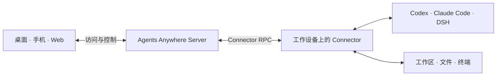

<p align="center">
  <a href="https://www.agents-anywhere.com"></a>
</p>

<p align="center">
  <strong>连接工作设备，在桌面、手机和 Web 管理 AI Agent。</strong><br>
  开源 · 多种 Agent · 会话与工作区 · 自托管
</p>

<p align="center">
  <a href="https://www.agents-anywhere.com">官网</a> ·
  <a href="#下载与入口">下载客户端</a> ·
  <a href="https://web.agents-anywhere.com">打开 Web</a> ·
  <a href="docs/README.md">使用文档</a> ·
  <a href="README.en.md">English</a>
</p>

<p align="center">
  <a href="docs/releases/2.0.0.md"></a>
  <a href="#开源许可"></a>
  <a href="docker/README.md"></a>
</p>

**Agents Anywhere** 是跨设备的开源 Agent 工作台。连接运行 **Codex、Claude Code 或 DeepSeek Harness** 的工作设备，在桌面、手机和 Web 查看会话、回复请求、管理文件与终端。Agent 在连接的工作设备上执行任务。

## 下载与入口

在工作设备上安装桌面客户端，再通过手机、平板或 Web 访问。Linux 和无图形界面的服务器可使用 Connector CLI 接入。各客户端均可连接 Cloud 或自托管服务。

**直接使用 Web：** 打开 [web.agents-anywhere.com](https://web.agents-anywhere.com)，注册或登录，开始使用。服务器位于中国大陆，在中国大陆使用可获得最佳体验。

| 平台 | 获取客户端 |
| --- | --- |
| **macOS** | [Universal DMG · 2.0.0](https://modelscope.cn/models/t4wefan/deepseek-harness-desktop/resolve/master/Agents%20Anywhere-2.0.0-universal.dmg) |
| **Windows** | [x64 安装包 · 2.0.0](https://modelscope.cn/models/t4wefan/deepseek-harness-desktop/resolve/master/Agents%20Anywhere%20Setup%202.0.0-x64.exe) |
| **iOS / iPadOS** | [加入 TestFlight](https://testflight.apple.com/join/GKGaut99) |
| **Android** | [APK · 2.0.3](https://modelscope.cn/models/t4wefan/deepseek-harness-desktop/resolve/master/agents-anywhere-2.0.3-release.apk) |
| **Web** | [立即打开 Web](https://web.agents-anywhere.com) |
| **Linux / headless** | [运行 Connector CLI](connector/README.md) |

更多平台说明见[官网下载页](https://www.agents-anywhere.com/download)。旧版部署升级前请阅读[升级指南](docs/upgrading.md)。

<details>
<summary>平台要求、安装包与更新说明</summary>

- macOS：Apple Silicon / Intel 通用，已签名、公证。
- Windows：x64 桌面工作台，含本机 Connector；当前安装包未做代码签名。
- Android：Android 8.0 及以上。
- iOS / iPadOS：通过 TestFlight 安装测试版，以邀请页显示的可用状态为准。
- Linux / headless：运行 Connector 接入工作设备，通过其他客户端操作。

macOS、Windows 和 Android 的下载文件均为 **Agents Anywhere** 安装包，托管在 ModelScope 的 `t4wefan/deepseek-harness-desktop` 仓库中。历史 GitHub Releases 中的 0.1.x 安装包不作为 2.0 下载入口。当前发布客户端的应用内更新地址仍是占位配置，请通过上面的链接手动下载。

`main` 是当前开发主线。源码中的新修复不一定已进入上面的 2.0.0 安装包；产品、Connector 包和数据库 schema 的版本分别管理。发布范围见 [2.0.0 发布说明](docs/releases/2.0.0.md)。

</details>

## Agent 与工作区管理

<p align="center">
  
</p>

<a id="可以做什么"></a>

| 你想做的事 | 在 Agents Anywhere 中 |
| --- | --- |
| **管理项目与会话** | 在设备、项目和会话之间切换，通过时间线（Timeline）查看运行进度。 |
| **审批操作与回复请求** | 响应工具审批和输入请求；按 Runtime 能力打断或继续任务。 |
| **查看文件与使用终端** | 浏览与预览文件、上传下载附件，打开远程 shell 和交互式终端。 |
| **配置 Agent** | 配置 Codex、Claude Code 和 DSH；根据对应 Runtime 支持的能力选择模型、权限与操作。 |

Runtime 是工作设备上运行和连接 Agent 的组件。模型账号和调用费用遵循所使用 Agent 的规则。各 Runtime 的能力存在差异，具体操作以客户端显示为准。[DSH 接入说明 →](dsh-bridge-next/README.md)

## 桌面、移动端与 Web

<p align="center">
  
</p>

用手机查看进展、回复 Agent，在平板上打开工作区，回到电脑后继续处理。同一服务、同一账号下，自己的设备和会话可以从不同客户端访问。

**手机负责控制，工作设备负责执行。** 远程使用时，工作设备需要保持开机、联网，并让 Connector 与对应 Runtime 正常运行。上图 iPad 展示了回复 Agent 输入请求的界面。

## 首次使用

1. **登录服务。** 安装客户端或打开 Web，登录 Cloud，或填写自托管服务地址。
2. **连接工作设备。** Desktop 集成本机 Connector；服务器与无图形环境使用 [Connector CLI](connector/README.md)。
3. **准备 Agent 和项目。** 在工作设备上配置 Runtime、账号与工作目录，创建或打开会话。
4. **从其他设备访问。** 在手机、平板或另一台电脑登录同一服务和账号，访问自己的设备与任务。

详细配对步骤、登录排查和后台运行说明见[安装与首次使用](docs/getting-started.md)。

## 执行位置与自托管

Agent 使用 Connector 所在机器的工作区与权限。可以连接 Cloud，也可以在自己的服务器上部署 Agents Anywhere 服务。



会话内容、Timeline 和上传附件等数据会按功能经过或存储在 Server。自托管时，这些服务端数据由你部署的实例处理。

<a id="自托管快速开始"></a>

### 使用 Docker 部署

克隆仓库后，在根目录运行以下命令，先替换示例密码和密钥：

```bash
POSTGRES_PASSWORD=replace-with-a-strong-password \
AGENT_SERVER_SECRET=replace-with-a-long-random-secret \
docker compose -f docker/docker-compose.postgres.yml up --build
```

打开 `http://127.0.0.1:5174`，从 Server 日志取得 setup token，完成首位管理员设置。Compose 包含 PostgreSQL、Redis、迁移任务以及托管 Web 的 Server。

[完整部署步骤](docker/README.md) · [备份与升级](docs/upgrading.md) · [Server 文档](server/README.md)

<a id="架构与源码"></a>

## 开发与贡献

开发环境使用 **Python 3.12+ / uv / Node.js 22 / Corepack + Yarn**。从[开发指南](docs/development.md)开始，查看源码运行方式与 headless 检查。

| 想了解什么 | 从这里开始 |
| --- | --- |
| 整体架构与 API | [Server 架构](docs/server-architecture.md) · [API 文档](docs/api/README.md) |
| Agent 接入与本机执行 | [Connector](connector/README.md) · [Runtime 协议](docs/runtime-protocol/README.md) |
| Web 与桌面客户端 | [Web 源码](web-next/) · [Desktop Workbench](desktop-workbench/README.md) |
| 原生移动客户端 | [Android](android/README.md) · [iOS 源码](ios/) |
| DSH 集成 | [DSH Bridge Next](dsh-bridge-next/README.md) |
| 更多文档 | [文档目录](docs/README.md) · [协议契约](contracts/) |

欢迎通过 [Issues](https://github.com/anywhere-labs/Agents-Anywhere/issues) 反馈问题，或通过 [Pull Requests](https://github.com/anywhere-labs/Agents-Anywhere/pulls) 参与改进。报告问题时，请附上客户端版本、系统、Runtime 类型和复现步骤，并移除日志中的凭据。

<a id="申请内测与联系方式"></a>

## 交流与反馈

欢迎加入社区，分享使用体验、反馈问题或参与开发。扫码加入微信群或 QQ 群参与交流。自托管实例的账号由自己的管理员管理。

| 微信群 | QQ 群 |
| --- | --- |
|  |  |

## 开源许可

MIT。README 中的产品截图与品牌素材说明见[图片来源与复现方式](docs/readme-artwork/README.md)。
